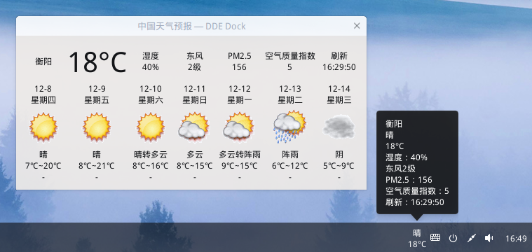

# WEATHER_DDE_DOCK
  
深度 Linux 系统天气任务栏插件（Qt5环境）。  
安装：install.sh  
卸载：uninstall.sh  
  
更新日志：  
2.1 (2017-01-24)  
1.使用本地图标代替边缘有白色的网络图标，以适应深度15.4 Dock的深色主题。  
2.增加右键菜单。  
  
2.0 (2016-12-08)  
1.点击Dock弹出窗口显示7天预报。  
  
1.0 (2016-11-09)  
在深度Dock栏显示天气，鼠标悬浮泡泡显示实时天气。